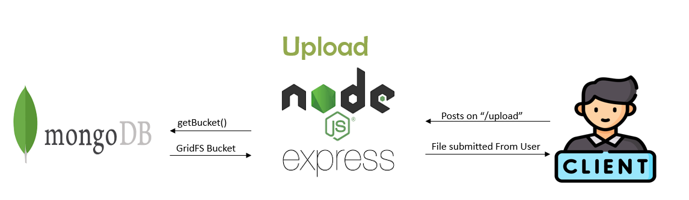
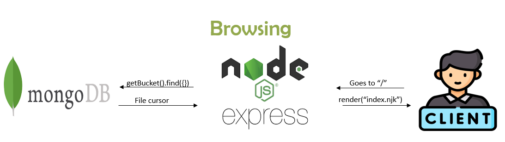

# ☁️ Cloudy (File Sharing System)


> ⚠️ **NOTE**: 
> MongoDB, Credentials, MongooseModel are ignored. 
> It's required to connect your own DB!

## 🚀 Overview

**NOTE**: This README is not updated as frequently as the documentation. Please check out the documentation above for the latest updates!

#### Context
- LLMs are a phenomenonal piece of technology for knowledge generation and reasoning.
- A big limitation of LLMs is context size (e.g. Davinci's limit is 4096 tokens. Large, but not infinite).
- The ability to feed "knowledge" to LLMs is restricted to this limited prompt size and model weights.

#### Proposed Solution

At its core, LlamaIndex contains a toolkit designed to easily connect LLM's with your external data.
LlamaIndex helps to provide the following:
- A set of **data structures** that allow you to index your data for various LLM tasks, and remove concerns over prompt size limitations.
- Data connectors to your common data sources (Google Docs, Slack, etc.).
- Cost transparency + tools that reduce cost while increasing performance.


Each data structure offers distinct use cases and a variety of customizable parameters. These indices can then be 
*queried* in a general purpose manner, in order to achieve any task that you would typically achieve with an LLM:
- Question-Answering
- Summarization
- Text Generation (Stories, TODO's, emails, etc.)
- and more!


## 💡 Contributing

Interesting in contributing? See our [Contribution Guide](CONTRIBUTING.md) for more details.

## 📄 Documentation

Full documentation can be found here: https://gpt-index.readthedocs.io/en/latest/. 

Please check it out for the most up-to-date tutorials, how-to guides, references, and other resources! 


## 💻 Example Usage

```
Connect MongoDB first -> npx nodemon helloworld.js 
```


```
    "dropzone": "^6.0.0-beta.2",
    "express": "^4.18.2",
    "express-session": "^1.17.3",
    "express-ws": "^5.0.2",
    "mongodb": "^4.11.0",
    "mongoose": "^6.8.0",
    "mosca": "^2.8.3",
    "multiparty": "^4.2.3",
    "nodemon": "^2.0.20",
    "nunjucks": "^3.2.3"
## 🔧 Dependencies
